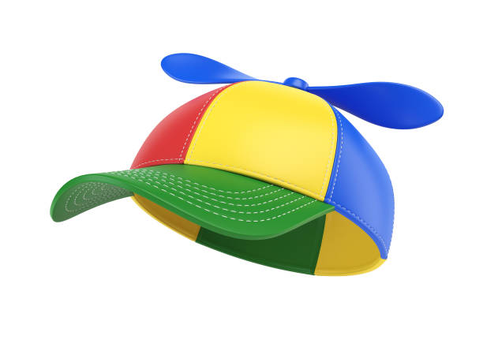
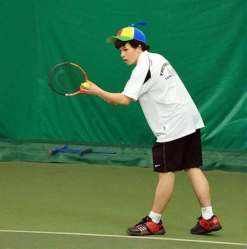

# ThinkNBlend: Context-Aware Object and Text Insertion Model

## Model Summary

ThinkNBlend is a multi-stage pipeline that performs context-aware insertion of synthetic objects and text into real-world images. The system combines GPT-4 Vision reasoning, zero-shot object detection, and Stable Diffusion-based blending to create realistic composite images.

### Method Summary

The pipeline operates in four main stages:

1. **GPT-4 Vision Reasoning**: Analyzes the main image and object/text to determine optimal placement
2. **Zero-Shot Object Detection**: Uses OWLv2 model to detect reference objects in the scene
3. **Bounding Box Computation**: Calculates target insertion area based on relative positioning
4. **Stable Diffusion Blending**: Uses UniCombine to seamlessly blend objects/text into the scene

### Pipeline Workflow Example

**Stage 1: GPT-4 Vision Analysis**

- Input: Main scene + target object
- Output: JSON description with reference object and placement strategy
- Example: "tennis player's head" → "place hat on top"

**Stage 2: Object Detection**

- Input: Main scene + reference object label
- Output: Bounding box coordinates for reference object
- Example: Detects tennis player's head location

**Stage 3: Target Box Calculation**

- Input: Reference box + relative position
- Output: Target insertion bounding box
- Example: Calculates hat placement area above head

**Stage 4: Image Generation**

- Input: Main scene + target object + target box
- Output: Final blended image
- Example: Hat inserted at calculated position

### Key Features

- **Object Insertion**: Realistically inserts objects (e.g., hats, bottles) into scenes
- **Text Insertion**: Adds text with customizable fonts, colors, and positions
- **Context Awareness**: Uses AI reasoning to determine natural placement
- **Quality Verification**: Optional object detection and OCR verification
- **Docker Deployment**: Containerized for easy GPU deployment
- **Simple Paste Mode**: Lightweight alternative without diffusion models

## Inputs / Outputs

### Supported Input Formats

**Object Insertion:**

- Main image: JPEG, PNG (any resolution)
- Object crop: JPEG, PNG (cropped object image)
- Output: JPEG with inserted object

**Text Insertion:**

- Main image: JPEG, PNG (any resolution)
- Text: String with font properties
- Output: JPEG with inserted text

### Output Specifications

- **Format**: JPEG
- **Quality**: High-resolution with realistic blending
- **Verification**: Optional quality assessment reports

### Enhanced JSON Outputs

The pipeline generates comprehensive intermediate outputs for analysis:

**GPT Vision Analysis (`gpt_full_response.json`):**

```json
{
  "raw_response": "Full GPT-4 Vision response text",
  "model": "gpt-4-vision-preview",
  "usage": {
    "completion_tokens": 245,
    "prompt_tokens": 1234,
    "total_tokens": 1479
  },
  "completion_tokens": 245,
  "prompt_tokens": 1234,
  "total_tokens": 1479
}
```

**Vision Reasoning (`object_vision_reasoning.json`):**

```json
{
  "reference_object": {
    "label": "tennis player's head",
    "description": "Natural spot for hat placement",
    "position_role": "reference"
  },
  "target_object": {
    "label": "colorful propeller hat",
    "description": "Whimsical hat for tennis player",
    "relative_position": "top",
    "inpainting_description": "Place hat on player's head"
  }
}
```

### Output Folder Structure

Each test run creates separate folders for organized output management:

```
sample_outputs/
├── sample_1_object_sample_1_obj_1/
│   ├── final_result.jpg              # Final blended image
│   ├── gpt_full_response.json        # Complete GPT API response
│   ├── object_vision_reasoning.json   # Parsed vision analysis
│   └── bounding_boxes_visualization.jpg # Debug visualization
│
├── sample_1_text_BRAND/
│   ├── final_result.jpg              # Final text insertion
│   ├── gpt_text_full_response.json   # GPT text analysis response
│   ├── text_vision_reasoning.json    # Text placement reasoning
│
└── sample_2_object_sample_2_obj_1/
    └── ... (similar structure)
```

**Benefits:**

- Isolated outputs prevent file conflicts
- Complete intermediate files for debugging
- Easy result comparison across tests
- Organized structure for batch processing

## Environment

### Dependencies

**Core Requirements:**

- Python 3.10+
- PyTorch 2.4.1
- Transformers 4.46.3
- OpenAI API access
- CUDA 11.8+ (for GPU acceleration)

**Additional Libraries:**

- EasyOCR (for text verification)
- Pillow
- OpenCV
- NumPy
- SciPy
- Timm

### Hardware Requirements

**Full Pipeline Mode (with UniCombine):**

- 34GB VRAM (NVIDIA GPU)
- CUDA 11.8+ support

**Simple Paste Mode:**

- CPU only (no GPU required)
- 4GB RAM minimum

**OpenAI API Access:**

- Required for both modes
- GPT-4 Vision API access
- Estimated cost: <$0.01 per image

### Performance Metrics

**Full Pipeline Mode:**

- **Processing Time**: 30-60 seconds per image (GPU)
- **Memory Usage**: 34-40GB VRAM during processing
- **Batch Processing**: Supported for multiple images

**Simple Paste Mode:**

- **Processing Time**: 5-15 seconds per image (CPU)
- **Memory Usage**: 2-4GB RAM during processing
- **Batch Processing**: Faster for multiple images

## Limitations

### Technical Limitations

1. **Object Size**: Very small or very large objects may not blend well
2. **Complex Scenes**: Highly cluttered backgrounds may affect placement accuracy
3. **Text Length**: Very long text strings may not fit properly
4. **Lighting**: Extreme lighting conditions may affect realism
5. **GPU Dependency**: Requires NVIDIA GPU with 34GB+ VRAM for optimal performance

### Quality Limitations

1. **Artifacts**: Occasional blending artifacts at object boundaries
2. **Perspective**: May not perfectly match scene perspective
3. **Shadows**: Limited shadow generation for inserted objects
4. **Reflections**: No automatic reflection generation
5. **Occlusion**: Limited handling of object occlusion

### Edge Cases

1. **Transparent Objects**: May not handle transparency well
2. **Moving Objects**: Designed for static scenes
3. **Multiple Objects**: Sequential insertion only
4. **Text Orientation**: Limited to horizontal text
5. **Language Support**: Primarily English text

## Improvement Ideas

### Short-term Improvements

1. **Enhanced Blending**: Implement more advanced blending algorithms
2. **Shadow Generation**: Add automatic shadow casting
3. **Batch Processing**: Optimize for multiple insertions
4. **Error Handling**: Better error recovery and reporting

### Long-term Enhancements

1. **Multi-object Insertion**: Support simultaneous multiple objects
2. **Dynamic Lighting**: Automatic lighting adjustment
3. **3D Integration**: Support for 3D object models
4. **Custom Training**: Fine-tune models for specific domains

## Example Pipeline Output

### Input Images

- **Main Scene**: A tennis player in action


- **Target Object**: A colorful propeller hat



### GPT-4 Vision Analysis

The pipeline analyzed the scene and generated this description:

```json
{
  "reference_object": {
    "label": "tennis player's head",
    "description": "The head of the tennis player is a natural spot for a hat, fitting the context of someone ready to play tennis.",
    "position_role": "reference"
  },
  "target_object": {
    "label": "colorful propeller hat",
    "description": "A colorful propeller hat, adding a fun and playful element to the tennis player's appearance.",
    "relative_position": "top",
    "inpainting_description": "Place a colorful propeller hat on the tennis player's head, adding a whimsical touch to his appearance during the match."
  }
}
```

### Object Detection and Bounding Box Visualization

The pipeline detected the tennis player's head and calculated the optimal placement for the hat:


_Red box: Detected reference object (tennis player's head)_
_Green box: Calculated target insertion area_

### Final Output

Using Diffusion based Unicombine Model, the hat was inserted at the calculated position:



_The colorful propeller hat has been placed on the tennis player's head as determined by the AI reasoning and object detection pipeline._

## Citation

If you use ThinkNBlend in your research, please cite:

```bibtex
@misc{thinknblend2025,
  title={ThinkNBlend: Context-Aware Object and Text Insertion Pipeline},
  author={Alaeddin Abdellaoui},
  year={2025},
  url={https://github.com/ma-abdellaoui/ThinkNBlend}
}
```

## License

This project is licensed under the Apache-2.0 License - see the LICENSE file for details.
