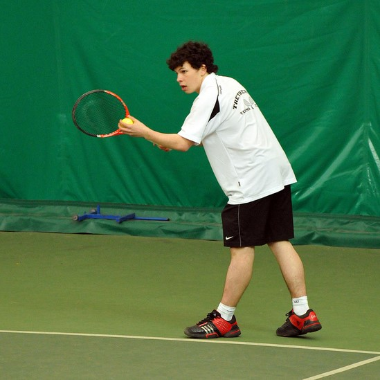
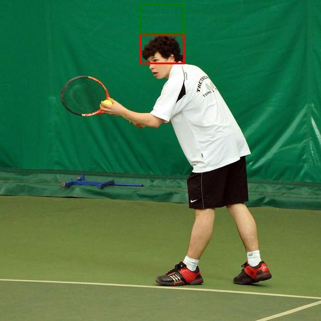

# ThinkNBlend: Context-Aware Object and Text Insertion Model

## Model Summary

ThinkNBlend is a multi-stage pipeline that performs context-aware insertion of synthetic objects and text into real-world images. The system combines GPT-4 Vision reasoning, zero-shot object detection, and Stable Diffusion-based blending to create realistic composite images.

### Method Summary

The pipeline operates in four main stages:

1. **GPT-4 Vision Reasoning**: Analyzes the main image and object/text to determine optimal placement
2. **Zero-Shot Object Detection**: Uses OWLv2 model to detect reference objects in the scene
3. **Bounding Box Computation**: Calculates target insertion area based on relative positioning
4. **Stable Diffusion Blending**: Uses UniCombine to seamlessly blend objects/text into the scene

### Pipeline Workflow Example

**Stage 1: GPT-4 Vision Analysis**

- Input: Main scene + target object
- Output: JSON description with reference object and placement strategy
- Example: "tennis player's head" → "place hat on top"

**Stage 2: Object Detection**

- Input: Main scene + reference object label
- Output: Bounding box coordinates for reference object
- Example: Detects tennis player's head location

**Stage 3: Target Box Calculation**

- Input: Reference box + relative position
- Output: Target insertion bounding box
- Example: Calculates hat placement area above head

**Stage 4: Image Generation**

- Input: Main scene + target object + target box
- Output: Final blended image
- Example: Hat inserted at calculated position

### Key Features

- **Object Insertion**: Realistically inserts objects (e.g., hats, bottles) into scenes
- **Text Insertion**: Adds text with customizable fonts, colors, and positions
- **Context Awareness**: Uses AI reasoning to determine natural placement
- **Quality Verification**: Optional object detection and OCR verification
- **Docker Deployment**: Containerized for easy GPU deployment
- **Simple Paste Mode**: Lightweight alternative without diffusion models

## Inputs / Outputs

### Supported Input Formats

**Object Insertion:**

- Main image: JPEG, PNG (any resolution)
- Object crop: JPEG, PNG (cropped object image)
- Output: JPEG with inserted object

**Text Insertion:**

- Main image: JPEG, PNG (any resolution)
- Text: String with font properties
- Position: top, bottom, left, right
- Output: JPEG with inserted text

### Output Specifications

- **Format**: JPEG
- **Quality**: High-resolution with realistic blending
- **Metadata**: Includes bounding box coordinates and confidence scores
- **Verification**: Optional quality assessment reports

## Environment

### Dependencies

**Core Requirements:**

- Python 3.10+
- PyTorch 2.4.1
- Transformers 4.46.3
- OpenAI API access
- CUDA 11.8+ (for GPU acceleration)

**Additional Libraries:**

- EasyOCR (for text verification)
- Pillow (image processing)
- OpenCV (computer vision)

### Hardware Requirements

**Minimum:**

- 8GB VRAM (NVIDIA GPU)
- 10GB storage

### Performance Metrics

- **Processing Time**: 30-60 seconds per image (GPU) (when using diffusion based Blending)
- **Memory Usage**: 34-40GB VRAM during processing (when using diffusion based Blending)
- **Batch Processing**: Supported for multiple images

## Limitations

### Technical Limitations

1. **Object Size**: Very small or very large objects may not blend well
2. **Complex Scenes**: Highly cluttered backgrounds may affect placement accuracy
3. **Text Length**: Very long text strings may not fit properly
4. **Lighting**: Extreme lighting conditions may affect realism
5. **GPU Dependency**: Requires NVIDIA GPU with 34GB+ VRAM for optimal performance

### Quality Limitations

1. **Artifacts**: Occasional blending artifacts at object boundaries
2. **Perspective**: May not perfectly match scene perspective
3. **Shadows**: Limited shadow generation for inserted objects
4. **Reflections**: No automatic reflection generation
5. **Occlusion**: Limited handling of object occlusion

### Edge Cases

1. **Transparent Objects**: May not handle transparency well
2. **Moving Objects**: Designed for static scenes
3. **Multiple Objects**: Sequential insertion only
4. **Text Orientation**: Limited to horizontal text
5. **Language Support**: Primarily English text

## Usage Examples

### Object Insertion

```bash
python main.py --mode object \
  --main_image input/scene.jpg \
  --object_crop input/hat.png \
  --verify
```

### Text Insertion

```bash
python main.py --mode text \
  --main_image input/scene.jpg \
  --text "BRAND" \
  --verify
```

### Docker Deployment

```bash
docker-compose up --build
```

## Example Pipeline Output

### Input Images

- **Main Scene**: A tennis player in action



- **Target Object**: A colorful propeller hat


### GPT-4 Vision Analysis

The pipeline analyzed the scene and generated this description:

```json
{
  "reference_object": {
    "label": "tennis player's head",
    "description": "The head of the tennis player is a natural spot for a hat, fitting the context of someone ready to play tennis.",
    "position_role": "reference"
  },
  "target_object": {
    "label": "colorful propeller hat",
    "description": "A colorful propeller hat, adding a fun and playful element to the tennis player's appearance.",
    "relative_position": "top",
    "inpainting_description": "Place a colorful propeller hat on the tennis player's head, adding a whimsical touch to his appearance during the match."
  }
}
```

### Object Detection and Bounding Box Visualization

The pipeline detected the tennis player's head and calculated the optimal placement for the hat:



_Red box: Detected reference object (tennis player's head)_
_Green box: Calculated target insertion area_

### Final Output

Using simple paste mode, the hat was inserted at the calculated position:


_The colorful propeller hat has been placed on the tennis player's head as determined by the AI reasoning and object detection pipeline._

## Citation

If you use ThinkNBlend in your research, please cite:

```bibtex
@misc{thinknblend2024,
  title={ThinkNBlend: Context-Aware Object and Text Insertion Pipeline},
  author={Alaeddin Abdellaoui},
  year={2025},
  url={https://github.com/ma-abdellaoui/ThinkNBlend}
}
```

## License

This project is licensed under the Apache-2.0 License - see the LICENSE file for details.
