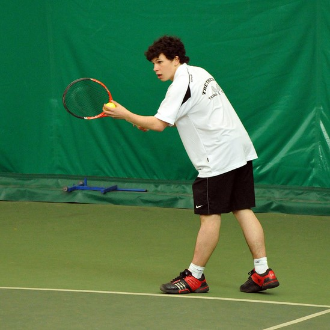
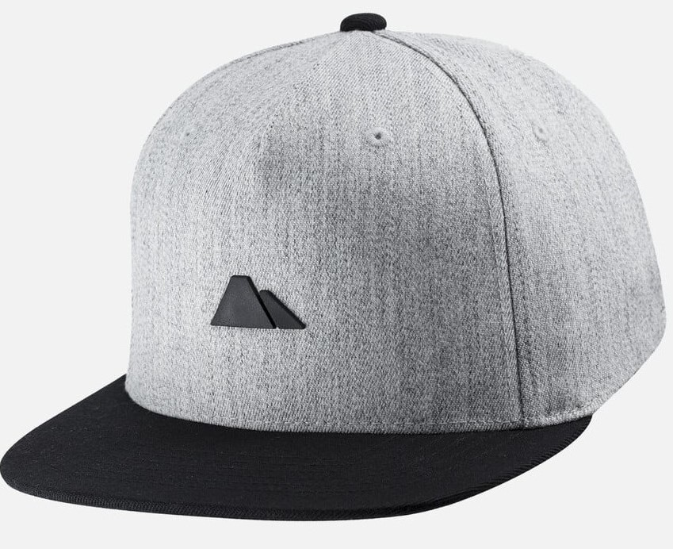
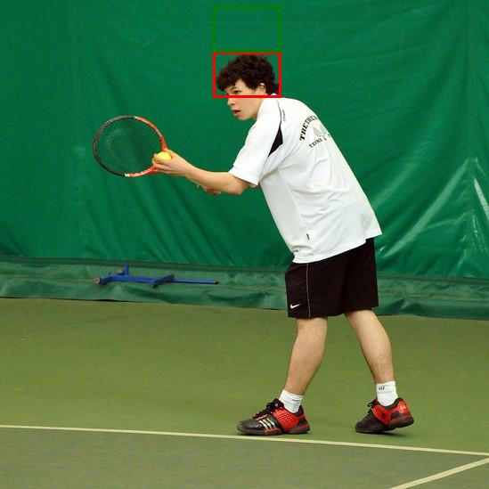

# ThinkNBlend: Context-Aware Object and Text Insertion Pipeline

A comprehensive pipeline for realistically inserting synthetic objects and text into images using GPT-4 Vision reasoning, zero-shot object detection, and Stable Diffusion blending.


## 🚀 Features

- **Object Insertion**: Realistically insert objects (hats, bottles, etc.) into scenes
- **Text Insertion**: Add text with customizable fonts, colors, and positions
- **Context Awareness**: AI-powered reasoning for natural placement
- **Quality Verification**: Optional object detection and OCR verification
- **Batch Processing**: Handle multiple images efficiently
- **Docker Deployment**: Containerized for GPU deployment
- **Simple Paste Mode**: Lightweight alternative without diffusion models (no GPU required)
- **Comprehensive Outputs**: Separate folders with all intermediate files and GPT responses
- **Modular Configuration**: Centralized prompt and model management in config.py

## 📋 Requirements

- Python 3.10+
- NVIDIA GPU with CUDA 11.8+
- OpenAI API key
- 8GB+ RAM, 34GB+ VRAM(Only if using Diffusion based Blending)

## 🛠️ Installation

### Local Installation

1. Clone the repository:

```bash
git clone https://github.com/your-repo/ThinkNBlend.git
cd ThinkNBlend
```

2. Install dependencies:

```bash
pip install -r requirements.txt
```

3. Set up environment variables:

```bash
export OPENAI_API_KEY="your-api-key-here"
```

### UniCombine Setup (Required for Diffusion based Blending)

**IMPORTANT**: Before using ThinkNBlend, you must set up the UniCombine model in case you want to use the diffusion based blending:

1. **Navigate to UniCombine directory**:

   ```bash
   cd submodules/UniCombine
   ```

2. **Follow UniCombine README instructions**:

   - Download the required model weights
   - Install UniCombine-specific requirements
   - Set up the model checkpoints (update checkpoint paths in downloaded elsewhere)

3. **Install UniCombine requirements**:

   ```bash
   pip install -r requirements.txt
   ```

4. **Download model weights** (refer to UniCombine documentation for specific URLs):

   - FLUX.1-schnell model
   - Condition-LoRA weights
   - Denoising-LoRA weights

**Note**: The exact download instructions and model URLs can be found in the UniCombine repository README at `submodules/UniCombine/README.md`.

### Docker Installation

1. Build the Docker image:

```bash
docker build -t thinknblend .
```

2. Run with GPU support:

```bash
docker run --gpus all -v $(pwd)/input:/app/input -v $(pwd)/output:/app/output thinknblend
```

## 🎯 Usage

### Object Insertion

Insert an object into a scene:

```bash
python main.py --mode object \
  --main_image input/scene.jpg \
  --object_crop input/hat.png \
  --verify
```

**Simple Paste Mode** (no GPU required):

```bash
python main.py --mode object \
  --main_image input/scene.jpg \
  --object_crop input/hat.png \
  --simple_paste
```

### Text Insertion

Insert text into a scene:

```bash
python main.py --mode text \
  --main_image input/scene.jpg \
  --text "BRAND" \
  --verify
```

**Simple Paste Mode** (no GPU required):

```bash
python main.py --mode text \
  --main_image input/scene.jpg \
  --text "BRAND" \
  --simple_paste
```

### Model Management

List available models:

```bash
python main.py --mode list-models
```

Use a specific diffusion model:

```bash
python main.py --mode object \
  --main_image input/scene.jpg \
  --object_crop input/hat.png \
  --diffusion_model unicombine \
  --verify
```

### Batch Processing

Process multiple images:

```bash
# Object insertion batch
python -m think_n_blend.batch_processor \
  --mode object \
  --input_dir input/scenes \
  --object_crops_dir input/objects \
  --verify

# Text insertion batch
python -m think_n_blend.batch_processor \
  --mode text \
  --input_dir input/scenes \
  --texts  "BRAND" "LOGO" \
  --verify
```

**Simple Paste Mode** (no GPU required):

```bash
# Test with simple paste
python test_pipeline.py --simple_paste
```

## 🧪 Testing

### Test Pipeline

The test pipeline provides comprehensive testing with sample images:

```bash
# Full pipeline test (requires GPU and UniCombine models)
python test_pipeline.py

# Simple paste test (no GPU required)
python test_pipeline.py --simple_paste
```

#### Sample Structure Required

The test pipeline expects this structure:

```
sample_inputs/
├── sample_1.jpg          # Main scene image
├── sample_1_obj_1.jpg    # First object to insert
└── sample_1_obj_2.jpg    # Second object to insert
```

#### Test Pipeline Features

- **Automated Testing**: Tests both object and text insertion
- **Sample Texts**: Tests with "BRAND", "LOGO", "DEMO"
- **Separate Folders**: Creates individual folders for each test
- **Comprehensive Logging**: Detailed pipeline execution logs
- **Error Handling**: Graceful handling of failed insertions
- **Performance Metrics**: Success rates and error summaries

#### Test Results Structure

Each test creates a dedicated folder:

```
sample_outputs/
├── sample_1_object_sample_1_obj_1/
│   ├── final_result.jpg                # Final result
│   ├── gpt_full_response.json          # GPT-4 response
│   ├── object_vision_reasoning.json    # Reasoning data
│   ├── simple_paste_result.jpg         # Service output
│   └── object_bounding_boxes_visualization.jpg
├── sample_1_text_BRAND/
│   ├── final_result.jpg                # Text insertion result
│   ├── gpt_text_full_response.json     # GPT-4 response
│   ├── text_vision_reasoning.json      # Reasoning data
│   ├── simple_text_BRAND.jpg           # Service output
│   └── text_bounding_boxes_visualization.jpg
└── ... (additional test folders)
```

#### CLI Entry Points

The CLI can be accessed through multiple methods:

```bash
# Method 1: Direct script execution
python main.py --mode object --main_image input/scene.jpg --object_crop input/hat.png

# Method 2: Module execution
python -m think_n_blend.cli --mode object --main_image input/scene.jpg --object_crop input/hat.png
```

## 🏗️ Architecture

The pipeline consists of four main stages:

1. **GPT-4 Vision Reasoning**: Analyzes images and determines optimal placement
2. **Zero-Shot Object Detection**: Uses OWLv2 to detect reference objects
3. **Bounding Box Computation**: Calculates target insertion areas
4. **Stable Diffusion Blending**: Uses diffusion models for seamless integration

### Modular Design

ThinkNBlend uses a modular architecture that supports multiple models:

- **Model Manager**: Centralized model configuration and management
- **Git Submodules**: External model repositories managed as submodules
- **Service Layer**: Clean separation of concerns with dedicated services
- **Configuration-Driven**: Easy model switching via configuration files

### Supported Models

- **Diffusion Models**: UniCombine (expandable to other models)
- **Object Detection**: OWLv2 (expandable to other detectors)
- **Text Recognition**: EasyOCR for verification

## 📁 Project Structure

```
ThinkNBlend/
├── main.py                          # Entry point
├── test_pipeline.py                 # Test pipeline with sample images
├── think_n_blend/                   # Main package
│   ├── __init__.py
│   ├── cli.py                      # Command-line interface
│   ├── config.py                   # Configuration and prompts
│   ├── schemas.py                  # Data structures
│   ├── batch_processor.py          # Batch processing
│   ├── models/                     # Model interfaces
│   ├── services/                   # Business logic
│   │   ├── vision_service.py       # GPT-4 Vision reasoning
│   │   ├── detection_service.py    # Object detection
│   │   ├── composition_service.py  # Bounding box computation
│   │   ├── blending_service.py     # Diffusion model integration
│   │   ├── text_service.py         # Text insertion
│   │   ├── verification_service.py # Quality verification
│   │   ├── model_manager.py        # Model management
│   │   └── simple_paste_service.py # GPU-free alternatives
│   └── utils/                      # Utilities
│       └── image_utils.py          # Image processing
├── submodules/                     # External model repositories
│   ├── README.md                   # Submodules documentation
│   └── UniCombine/                 # UniCombine (git submodule)
├── sample_inputs/                  # Sample test images
├── sample_outputs/                 # Test results with organized folders
├── input/                          # Input images
├── output/                         # Generated images
├── Dockerfile                      # Docker configuration
├── docker-compose.yml              # Docker deployment
├── requirements.txt                # Python dependencies
├── MODEL_CARD.md                   # Model documentation
└── QUALITY_ASSESSMENT.md           # Quality evaluation
```

## 📂 Output Structure

The pipeline creates organized output folders for detailed analysis and debugging:

### Individual CLI Usage

```
output/
├── final_result.jpg                    # Final processed image
├── gpt_full_response.json              # Complete GPT-4 Vision response
├── object_vision_reasoning.json        # Extracted object reasoning
├── text_vision_reasoning.json          # Extracted text reasoning
├── simple_paste_result.jpg             # Simple paste mode result
├── simple_text_[TEXT].jpg               # Simple text insertion result
├── object_bounding_boxes_visualization.jpg  # Debug visualization
└── text_bounding_boxes_visualization.jpg    # Text placement visualization
```

### Test Pipeline Output

Each test creates a separate folder with all intermediate files:

```
sample_outputs/
├── sample_1_object_sample_1_obj_1/     # Object insertion test
│   ├── final_result.jpg                # Final blended image
│   ├── gpt_full_response.json          # Complete GPT API response
│   ├── object_vision_reasoning.json    # Parsed reasoning data
│   ├── simple_paste_result.jpg         # Direct service output
│   └── object_bounding_boxes_visualization.jpg  # Debug overlay
├── sample_1_text_BRAND/                # Text insertion test
│   ├── final_result.jpg                # Final text insertion
│   ├── gpt_text_full_response.json     # Complete GPT API response
│   ├── text_vision_reasoning.json      # Parsed reasoning data
│   ├── simple_text_BRAND.jpg           # Direct service output
│   └── text_bounding_boxes_visualization.jpg   # Debug overlay
└── ...
```

### JSON Output Files

#### GPT Full Response (`gpt_full_response.json` / `gpt_text_full_response.json`)

Contains complete API interaction data:

````json
{
  "raw_response": "```json\n{...}\n```",
  "model": "gpt-4o",
  "text_to_insert": "BRAND", // For text insertions only
  "usage": {
    "completion_tokens": 127,
    "prompt_tokens": 1812,
    "total_tokens": 1939
  }
}
````

#### Vision Reasoning (`object_vision_reasoning.json` / `text_vision_reasoning.json`)

Contains extracted reasoning results:

```json
{
  "reference_object": {
    "label": "tennis player",
    "description": "Suitable reference for object placement",
    "position_role": "reference"
  },
  "target_object": {
    "label": "cap",
    "relative_position": "top",
    "inpainting_description": "Placement description for diffusion model"
  }
}
```

## 🔧 Configuration

### Environment Variables

- `OPENAI_API_KEY`: Your OpenAI API key
- `CUDA_VISIBLE_DEVICES`: GPU device selection

### Model Configuration

Edit `think_n_blend/config.py` to customize:

- **GPT-4 Vision Prompts**:
  - `GPT4_VISION_PROMPT` for object insertion
  - `GPT4_TEXT_VISION_PROMPT` for text insertion
- **Model Settings**: GPT-4 model version, object detection models
- **Processing Parameters**: Batch size, verification settings, output formats

## 📊 Quality Assessment

The pipeline includes suggestions for a comprehensive quality assessment:

- **Visual Realism**: FID, LPIPS, CLIPScore metrics
- **Label Accuracy**: Object detection and OCR verification
- **Diversity**: Dataset coverage and variation analysis
- **Training Effectiveness**: Model performance evaluation

See `QUALITY_ASSESSMENT.md` for detailed evaluation framework.

## 🐳 Docker Deployment

### Quick Start

```bash
# Build and run
docker-compose up --build

# Run with custom command
docker run --gpus all -v $(pwd)/input:/app/input -v $(pwd)/output:/app/output \
  thinknblend python main.py --mode object --main_image input/scene.jpg --object_crop input/hat.png
```

### Production Deployment

1. Set up NVIDIA Container Toolkit
2. Configure GPU resources
3. Set environment variables
4. Mount input/output volumes

## 📈 Performance

- **Processing Time**: 30-60 seconds per image (GPU) (if using diffusion blending)
- **Memory Usage**: 34-40GB VRAM during processing (if using diffusion blending)
- **Quality**: High-resolution outputs with realistic blending

This will:

- Run object detection on inserted objects
- Perform OCR on inserted text
- Generate confidence scores
- Save verification reports

## 📝 Examples

### Object Insertion Example

### Input Images

Sample images are provided in the `sample_inputs/` directory:

- **Main Scene**: A tennis player in action (`sample_inputs/sample_1.jpg`)



- **Target Object**: A gray and black cap (`sample_inputs/sample_1_obj_1.jpg`)



### GPT-4 Vision Analysis

The pipeline analyzed the scene and generated this description:

```json
{
  "reference_object": {
    "label": "head",
    "description": "The player's head is suitable as it is a natural place to wear a cap.",
    "position_role": "reference"
  },
  "target_object": {
    "label": "cap",
    "description": "A gray and black cap that fits well as headwear for the player.",
    "relative_position": "top",
    "inpainting_description": "A gray cap with a black brim placed on the player's head, completing the sporty outfit."
  }
}
```

### Object Detection and Bounding Box Visualization

The pipeline detected the tennis player's head and calculated the optimal placement for the hat:



_Red box: Detected reference object (tennis player's head)_
_Green box: Calculated target insertion area_

### Final Output

Using diffusion mode, the hat was inserted at the calculated position:


_The gray and black cap has been placed on the tennis player's head as determined by the AI reasoning and object detection pipeline._

> ℹ️ See MODEL_CARD.md For another Example.

> ℹ️ The outputs in sample_output are generated using simple copy-paste method due to lack of hardware GPU at the time of writing this readme.

## 🤝 Contributing

1. Fork the repository
2. Create a feature branch
3. Make your changes
4. Submit a pull request

## 📄 License

This project is licensed under the Apache-2.0 - see the LICENSE file for details.

## 📚 Citation

If you use ThinkNBlend in your research:

```bibtex
@misc{thinknblend2025,
  title={ThinkNBlend: Context-Aware Object and Text Insertion Pipeline},
  author={Alaeddin Abdellaoui},
  year={2025},
  url={https://github.com/ma-abdellaoui/ThinkNBlend/}
}
```

## 🆘 Support

- Check the [Model Card](MODEL_CARD.md) for detailed documentation
- Review [Quality Assessment](QUALITY_ASSESSMENT.md) for evaluation methods
- Open an issue for bugs or feature requests
- Join our community discussions

## 🔄 Updates

- **v1.0**: Initial release
