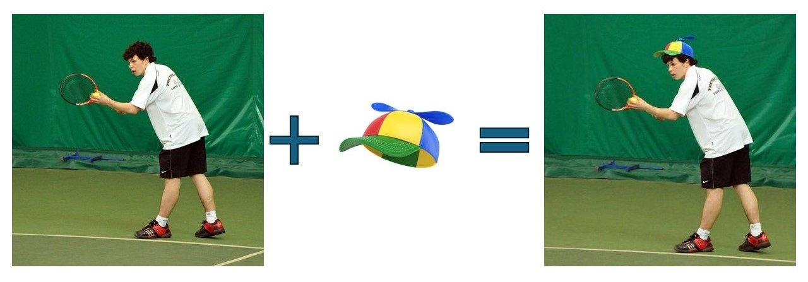

# ThinkNBlend: Context-Aware Object and Text Insertion Pipeline

A comprehensive pipeline for realistically inserting synthetic objects and text into images using GPT-4 Vision reasoning, zero-shot object detection, and Stable Diffusion blending.



## 🚀 Features

- **Object Insertion**: Realistically insert objects (hats, bottles, etc.) into scenes
- **Text Insertion**: Add text with customizable fonts, colors, and positions
- **Context Awareness**: AI-powered reasoning for natural placement
- **Quality Verification**: Optional object detection and OCR verification
- **Batch Processing**: Handle multiple images efficiently
- **Docker Deployment**: Containerized for GPU deployment

## 📋 Requirements

- Python 3.10+
- NVIDIA GPU with CUDA 11.8+
- OpenAI API key
- 8GB+ RAM, 34GB+ VRAM

## 🛠️ Installation

### Local Installation

1. Clone the repository:

```bash
git clone https://github.com/your-repo/ThinkNBlend.git
cd ThinkNBlend
```

2. Install dependencies:

```bash
pip install -r requirements.txt
```

3. Set up environment variables:

```bash
export OPENAI_API_KEY="your-api-key-here"
```

### UniCombine Setup (Required)

**IMPORTANT**: Before using ThinkNBlend, you must set up the UniCombine model:

1. **Navigate to UniCombine directory**:

   ```bash
   cd submodules/UniCombine
   ```

2. **Follow UniCombine README instructions**:

   - Download the required model weights
   - Install UniCombine-specific requirements
   - Set up the model checkpoints

3. **Install UniCombine requirements**:

   ```bash
   pip install -r requirements.txt
   ```

4. **Download model weights** (refer to UniCombine documentation for specific URLs):

   - FLUX.1-schnell model
   - Condition-LoRA weights
   - Denoising-LoRA weights

5. **Verify installation**:
   ```bash
   python inference.py --help
   ```

**Note**: The exact download instructions and model URLs can be found in the UniCombine repository README at `submodules/UniCombine/README.md`.

### Docker Installation

1. Build the Docker image:

```bash
docker build -t thinknblend .
```

2. Run with GPU support:

```bash
docker run --gpus all -v $(pwd)/input:/app/input -v $(pwd)/output:/app/output thinknblend
```

## 🎯 Usage

### Object Insertion

Insert an object into a scene:

```bash
python main.py --mode object \
  --main_image input/scene.jpg \
  --object_crop input/hat.png \
  --verify
```

### Text Insertion

Insert text into a scene:

```bash
python main.py --mode text \
  --main_image input/scene.jpg \
  --text "BRAND" \
  --position top \
  --verify
```

### Model Management

List available models:

```bash
python main.py --mode list-models
```

Use a specific diffusion model:

```bash
python main.py --mode object \
  --main_image input/scene.jpg \
  --object_crop input/hat.png \
  --diffusion_model unicombine \
  --verify
```

### Batch Processing

Process multiple images:

```bash
# Object insertion batch
python -m think_n_blend.batch_processor \
  --mode object \
  --input_dir input/scenes \
  --object_crops_dir input/objects \
  --verify

# Text insertion batch
python -m think_n_blend.batch_processor \
  --mode text \
  --input_dir input/scenes \
  --texts  "BRAND" "LOGO" \
  --positions top bottom \
  --verify
```

## 🏗️ Architecture

The pipeline consists of four main stages:

1. **GPT-4 Vision Reasoning**: Analyzes images and determines optimal placement
2. **Zero-Shot Object Detection**: Uses OWLv2 to detect reference objects
3. **Bounding Box Computation**: Calculates target insertion areas
4. **Stable Diffusion Blending**: Uses diffusion models for seamless integration

### Modular Design

ThinkNBlend uses a modular architecture that supports multiple models:

- **Model Manager**: Centralized model configuration and management
- **Git Submodules**: External model repositories managed as submodules
- **Service Layer**: Clean separation of concerns with dedicated services
- **Configuration-Driven**: Easy model switching via configuration files

### Supported Models

- **Diffusion Models**: UniCombine (expandable to other models)
- **Object Detection**: OWLv2 (expandable to other detectors)
- **Text Recognition**: EasyOCR for verification

## 📁 Project Structure

```
ThinkNBlend/
├── main.py                          # Entry point
├── think_n_blend/                   # Main package
│   ├── __init__.py
│   ├── cli.py                      # Command-line interface
│   ├── config.py                   # Configuration
│   ├── schemas.py                  # Data structures
│   ├── batch_processor.py          # Batch processing
│   ├── services/                   # Business logic
│   │   ├── vision_service.py       # GPT-4 Vision
│   │   ├── detection_service.py    # Object detection
│   │   ├── composition_service.py  # Bounding box computation
│   │   ├── blending_service.py     # Diffusion model integration
│   │   ├── text_service.py         # Text insertion
│   │   ├── verification_service.py # Quality verification
│   │   └── model_manager.py        # Model management
│   └── utils/                      # Utilities
│       └── image_utils.py          # Image processing
├── submodules/                     # External model repositories
│   ├── README.md                   # Submodules documentation
│   └── UniCombine/                 # UniCombine (git submodule)
├── input/                          # Input images
├── output/                         # Generated images
├── Dockerfile                      # Docker configuration
├── docker-compose.yml              # Docker deployment
├── requirements.txt                # Python dependencies
├── MODEL_CARD.md                   # Model documentation
└── QUALITY_ASSESSMENT.md           # Quality evaluation
```

## 🔧 Configuration

### Environment Variables

- `OPENAI_API_KEY`: Your OpenAI API key
- `CUDA_VISIBLE_DEVICES`: GPU device selection

### Model Configuration

Edit `think_n_blend/config.py` to customize:

- GPT-4 Vision prompts
- Object detection models
- Blending parameters

## 📊 Quality Assessment

The pipeline includes comprehensive quality assessment:

- **Visual Realism**: FID, LPIPS, CLIPScore metrics
- **Label Accuracy**: Object detection and OCR verification
- **Diversity**: Dataset coverage and variation analysis
- **Training Effectiveness**: Model performance evaluation

See `QUALITY_ASSESSMENT.md` for detailed evaluation framework.

## 🐳 Docker Deployment

### Quick Start

```bash
# Build and run
docker-compose up --build

# Run with custom command
docker run --gpus all -v $(pwd)/input:/app/input -v $(pwd)/output:/app/output \
  thinknblend python main.py --mode object --main_image input/scene.jpg --object_crop input/hat.png
```

### Production Deployment

1. Set up NVIDIA Container Toolkit
2. Configure GPU resources
3. Set environment variables
4. Mount input/output volumes

## 📈 Performance

- **Processing Time**: 30-60 seconds per image (GPU)
- **Memory Usage**: 34-40GB VRAM during processing
- **Batch Processing**: Linear scaling with GPU memory
- **Quality**: High-resolution outputs with realistic blending

## 🔍 Verification

Enable verification to check insertion quality:

```bash
python main.py --mode object --verify
```

This will:

- Run object detection on inserted objects
- Perform OCR on inserted text
- Generate confidence scores
- Save verification reports

## 📝 Examples

### Object Insertion Example

Input:

- Main image: Person in a park
- Object crop: Baseball cap

Output:

- Realistically placed cap on person's head
- Proper lighting and shadow integration
- Context-aware positioning

### Text Insertion Example

Input:

- Main image: Street scene
- Text: "BRAND"

Output:

- Text integrated into scene
- Appropriate font and color
- Natural positioning

## 🤝 Contributing

1. Fork the repository
2. Create a feature branch
3. Make your changes
4. Add tests
5. Submit a pull request

## 📄 License

This project is licensed under the MIT License - see the LICENSE file for details.

## 📚 Citation

If you use ThinkNBlend in your research:

```bibtex
@misc{thinknblend2024,
  title={ThinkNBlend: Context-Aware Object and Text Insertion Pipeline},
  author={ThinkNBlend Team},
  year={2024},
  url={https://github.com/your-repo/ThinkNBlend}
}
```

## 🆘 Support

- Check the [Model Card](MODEL_CARD.md) for detailed documentation
- Review [Quality Assessment](QUALITY_ASSESSMENT.md) for evaluation methods
- Open an issue for bugs or feature requests
- Join our community discussions

## 🔄 Updates

- **v1.0**: Initial release with object insertion
- **v1.1**: Added text insertion capabilities
- **v1.2**: Implemented batch processing
- **v1.3**: Added quality verification
- **v1.4**: Docker containerization
